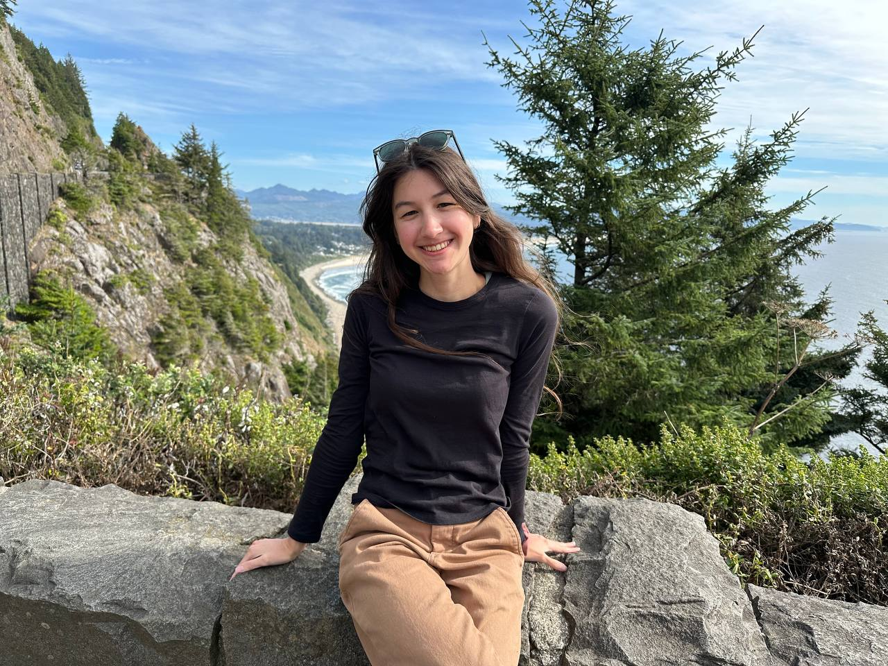

  

 

I graduated from Texas A&M University in 2021 with a Bachelor of Science in Industrial Engineering. Currently, I'm an energy scheduler at RWE Clean Energy. I'm still very early in my career and always looking to learn more about the industry.

In my spare time, I enjoy reading, exploring my neighborhood, and watching terrible movies with friends. 

**socials** 
- [vsco](https://vsco.co/soupenjoyer)
- [are.na](https://are.na/rachel-b-lrry9ex2uai)
- [linkedin](https://linkedin.com/in/rachel-beaulac) 